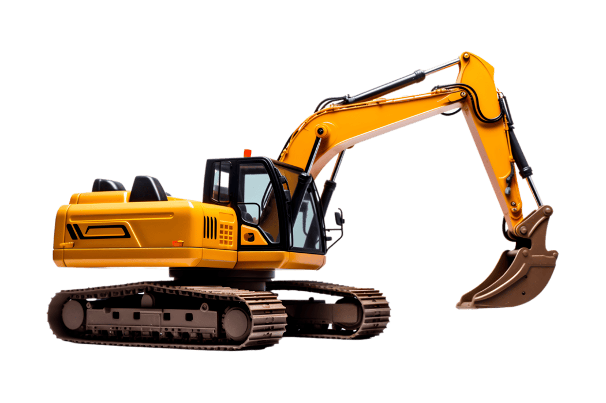

# Tecnología Aplicada

# Clase 01
´´´

## Apuntes de Clase

## 1. Mesa Material / Composición

Se enfoca en los **objetos en sí mismos**, su materia, estructura y procesos de fabricación.

- Analiza propiedades físicas y materiales.
- Considera cómo están hechos los objetos.
- También observa cómo **nos comportamos alrededor de los objetos**, es decir, cómo su materialidad influye en nuestras acciones.

**Pregunta central:**  
> ¿De qué está hecho esto?

**Relación con disciplinas:**
- Ciencias Sociales (producción y circulación de objetos)
- Antropología (cultura material)

---

## 2. Mesa Relacional / Uso

Se centra en la **interacción entre las personas y los objetos**.

- Analiza el uso y la función.
- Considera el contexto en el que ocurre la interacción.
- Se enfoca en la experiencia más que en la materialidad.

**Pregunta central:**  
> ¿Cómo se usa y qué relaciones genera?

---

## 3. La Tercera Mesa

La “tercera mesa” corresponde a un nivel **integrador y abstracto** que va más allá de lo material y lo funcional.

- Integra distintas perspectivas:
  - Material
  - Uso
  - Cultural
  - Simbólica

- Analiza:
  - Sistemas de pensamiento
  - Interpretaciones culturales
  - Estructuras de conocimiento

### Reflexión crítica

> La ciencia es muy segregadora en general.

Esto implica que el conocimiento suele dividirse en áreas separadas, fragmentando fenómenos que en realidad están interconectados.

La tercera mesa busca:

- Superar esta fragmentación
- Integrar distintas formas de conocimiento
- Entender los objetos dentro de redes complejas de significado

## Síntesis

- **Mesa 1 (Material):** Qué es el objeto  
- **Mesa 2 (Relacional):** Cómo se usa  
- **Mesa 3 (Integradora):** Qué significa dentro de un sistema más amplio (No)
- **Disciplina: El arte busca atrapar o unificar estas tres mesas.
- Imagen y ejecución.

- Leer la estetica de la cosmología.

  Cualquier cosa con una realidad unitaria: El objeto puede ser todo, una mesa, una silla, una canción y una idea. Todo está hecho de átomos.
  ¿Las canciones son objetos?

  # Tarea
  ## Escribir mis cualidades de forma Relacional y Material
  R:

m: Cómo puedo volver a sentirme bien? Cómo puedo volver a estar con mi cabeza en paz?
No siento que haya algo que me pese realmente, pero la culpa me está comiendo.

  
Tomar dos objetos diferentes para crear una nueva experiencia
Obj. real (Yo) /Obj. Sensorial (Aparecido)
Ejecución/ Imagen
Cualidades Reales/ Cualidades Sensoriales

Es distinto pensar en las cualidadess de algo y la apariencia de algo.
El onjeto cuadruple.
Como agregar una imagen.

Ordené estos apuntes con ChatGPT

## primera imagen ekisde
Puse una foto de una excavadora porque fue lo que tenía a la mano.

